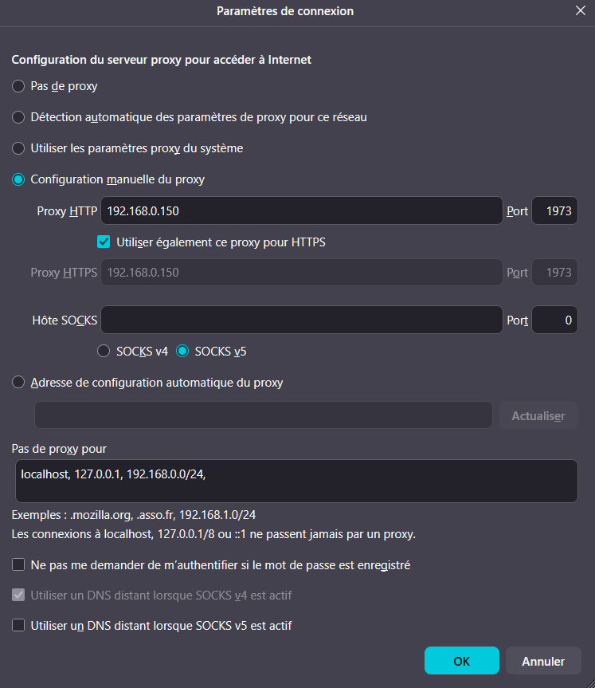
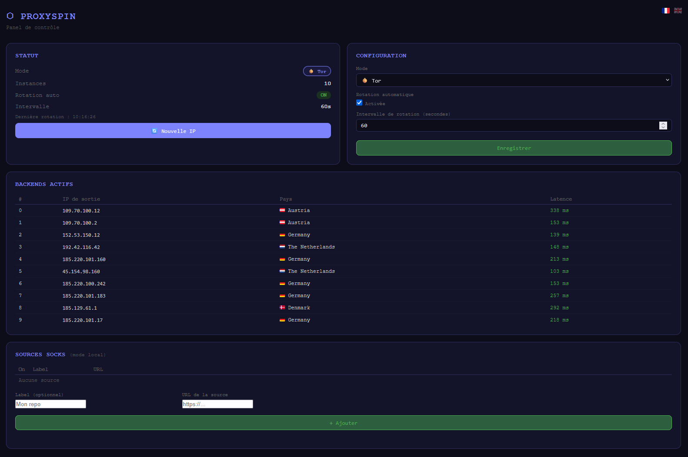
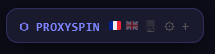
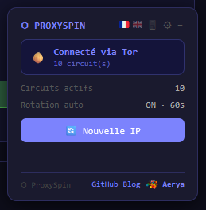
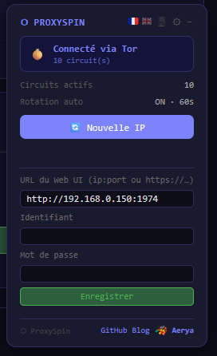
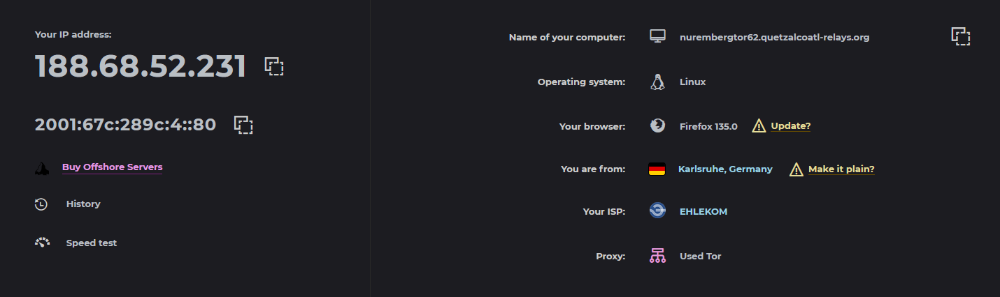
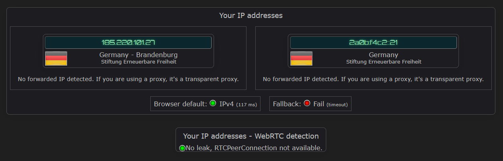

# ⬡ ProxySpin

> 🇬🇧 [English version](README.en.md) — 📝 [Article de présentation (fr)](https://...) *(à venir)*

Proxy HTTP rotatif anonymisant basé sur **Tor**, avec support optionnel de proxies SOCKS4/SOCKS5 privés — interface web et extension navigateur.

---

> ⚠️ **Avertissement**
>
> ProxySpin est un outil de rotation de proxies conçu pour améliorer la confidentialité et la gestion des connexions sortantes. Toutefois, il ne garantit en aucun cas un anonymat total.
>
> Il s'agit avant tout d'un proxy HTTP/HTTPS avancé, et non d'une solution de sécurité complète. De nombreux facteurs externes peuvent compromettre l'anonymat, notamment la configuration du navigateur, les fuites (WebRTC, DNS), le fingerprinting ou encore le comportement utilisateur.
>
> Même en mode Tor, l'anonymat dépend fortement de l'environnement global d'utilisation.

---

## Description

ProxySpin expose **un point d'entrée unique** (port 1973) derrière lequel chaque requête peut sortir avec une IP différente. Il supporte deux modes :

- **Tor** *(mode principal)* : N instances Tor indépendantes, chacune avec son propre circuit chiffré à 3 nœuds relais — anonymat fort, sans configuration supplémentaire
- **Local** *(optionnel)* : proxies SOCKS4/SOCKS5 privés ou payants fournis manuellement (fichiers `.txt`) ou via des URLs de listes configurées dans le Web UI

> ⚠️ Les proxies SOCKS **gratuits** (listes publiques) sont peu fiables et ne garantissent pas l'anonymat. Ce mode est conçu pour des proxies **privés ou commerciaux** de confiance.

## Architecture

```
Navigateur / Client
        │
        ▼
  Python Proxy :1973      ← point d'entrée exposé (Basic auth, HTTP + HTTPS CONNECT)
        │
        ▼
   HAProxy :11973          ← interne uniquement (localhost), load balancer TCP
        │  balance leastconn
        ├── Privoxy :20000
        ├── Privoxy :20001   ← chaque instance forward vers Tor ou un proxy SOCKS
        └── Privoxy :2000N
                │
        ┌───────┴──────────┐
        │ Mode Tor         │ Mode Local (SOCKS privés)
        │                  │
   Tor :10000         Proxy SOCKS4/5
   Tor :10001         (filtré par pays si actif)
   Tor :1000N
        │
   Réseau Tor → Internet (IP de sortie différente par circuit)
```

Le port **1973 est géré par un serveur Python** (calqué sur le mécanisme de Gluetun) qui vérifie l'authentification avant de transférer vers HAProxy interne sur le port 11973. HAProxy opère en **mode TCP** (compatible HAProxy 2.5+) et relaie les bytes bruts vers les instances Privoxy qui effectuent le vrai travail de proxy.

## Ports

| Port | Rôle | Auth |
|------|------|------|
| `1973` | Proxy HTTP rotatif (point d'entrée) | Basic auth (`PROXY_USER` / `PROXY_PASS`) |
| `1974` | Interface web de contrôle + API JSON | Basic auth (`STATS_USER` / `STATS_PASS`) |
| `1976` | HAProxy stats *(désactivé par défaut)* | Basic auth (`STATS_USER` / `STATS_PASS`) |

## Démarrage rapide

Éditer `docker-compose.yml` et renseigner les mots de passe :

```yaml
- PROXY_USER=monuser
- PROXY_PASS=motdepasse_fort
- STATS_USER=admin
- STATS_PASS=motdepasse_fort
```

Lancer :

```bash
docker compose up -d
```

## Configuration

Toutes les options sont des variables d'environnement dans `docker-compose.yml` :

| Variable | Défaut | Description |
|----------|--------|-------------|
| `ROTATION_INTERVAL` | `60` | Intervalle de rotation Tor en secondes |
| `tors` | `10` | Nombre d'instances Tor parallèles (mode `tor`) |
| `MAX_PROXIES` | `20` | Nombre de proxies SOCKS actifs dans HAProxy (mode `local`) |
| `COUNTRY_FILTER` | — | Filtre pays au démarrage, code ISO 2 lettres (ex. `FR`, `DE`) |
| `PROXY_USER` | — | Identifiant proxy port 1973 |
| `PROXY_PASS` | — | Mot de passe proxy |
| `STATS_USER` | — | Identifiant web UI + API ports 1974 et 1976 |
| `STATS_PASS` | — | Mot de passe web UI + API |
| `PROXY_AUTH_ENABLED` | `true` | Auth sur le port 1973 (`false` pour désactiver) |
| `API_AUTH_ENABLED` | `true` | Auth sur le port 1974 (`false` pour désactiver) |
| `STATS_AUTH_ENABLED` | `true` | Auth sur le port 1976 (`false` pour désactiver) |

### Désactiver l'authentification

Par défaut, les trois ports sont protégés. Pour désactiver l'auth sur un port (utile sur réseau local de confiance), décommenter la ligne correspondante dans `docker-compose.yml` :

```yaml
# - PROXY_AUTH_ENABLED=false   # port 1973 — proxy rotatif
# - API_AUTH_ENABLED=false     # port 1974 — Web UI + API
# - STATS_AUTH_ENABLED=false   # port 1976 — HAProxy stats
```

Quand une auth est désactivée, les variables `PROXY_USER`/`PROXY_PASS` ou `STATS_USER`/`STATS_PASS` correspondantes deviennent optionnelles.

### Détail des variables

**`ROTATION_INTERVAL`**
Intervalle en secondes entre deux renouvellements automatiques de circuits Tor. La rotation automatique est **active uniquement en mode Tor** et se désactive automatiquement en mode `local`. Elle peut être activée/désactivée manuellement depuis le Web UI à tout moment.

**`tors`**
En mode `tor`, ProxySpin démarre N processus Tor complètement indépendants. Chacun construit son propre circuit chiffré à 3 nœuds et possède sa propre IP de sortie. HAProxy répartit les requêtes entre ces N instances. Avec `tors=10`, vous avez 10 IPs de sortie différentes disponibles simultanément.

**`MAX_PROXIES`**
En mode `local`, seuls les `MAX_PROXIES` premiers proxies opérationnels sont activés dans HAProxy. Si un filtre pays est actif, ProxySpin élargit la recherche à `MAX_PROXIES × 5` candidats.

**`COUNTRY_FILTER`**
Entièrement optionnel. Peut être modifié à tout moment depuis le web UI ou le userscript, sans redémarrer.

## Sécurité

Les trois ports exposés peuvent être protégés par **HTTP Basic auth** :

- **Port 1973** (proxy) — serveur Python, identifiants `PROXY_USER` / `PROXY_PASS`
- **Port 1974** (web UI + API) — serveur Python, identifiants `STATS_USER` / `STATS_PASS`
- **Port 1976** (stats HAProxy) — HAProxy, identifiants `STATS_USER` / `STATS_PASS`

> ⚠️ **Réseau local** : si le navigateur est configuré pour utiliser le proxy 1973, tout le trafic transite par Privoxy→Tor, y compris les requêtes vers votre réseau local (192.168.x.x). Ajoutez vos adresses locales dans les exceptions proxy du navigateur pour accéder directement aux ports 1974 et 1976.
>
> Dans LibreWolf / Firefox : `Paramètres → Général → Paramètres réseau → Pas de proxy pour :`
> ```
> localhost, 127.0.0.1, 192.168.0.0/24
> ```

> ⚠️ **Fuite WebRTC** : WebRTC peut révéler votre adresse IP réelle même derrière un proxy, car il établit des connexions P2P en contournant la configuration proxy du navigateur. **Désactivez WebRTC** dans votre navigateur avant d'utiliser ProxySpin.
>
> Guide de désactivation (Chrome, Firefox, Safari, Opera, Edge) : [K3V1991/How-to-disable-WebRTC](https://github.com/K3V1991/How-to-disable-WebRTC-in-Chrome-Firefox-Safari-Opera-and-Edge)
>
> Sous LibreWolf / Firefox : `about:config` → `media.peerconnection.enabled` → `false`

## Utilisation

**Configurer le navigateur** pour utiliser `http://VOTRE_IP:1973` comme proxy HTTP (identifiants `PROXY_USER` / `PROXY_PASS` si auth activée).



**Interface web** : `http://VOTRE_IP:1974` (identifiants `STATS_USER` / `STATS_PASS` si auth activée)

**HAProxy stats** : `http://VOTRE_IP:1976/` (mêmes identifiants) — port désactivé par défaut, décommenter dans `docker-compose.yml` pour l'activer

## Mode SOCKS local (optionnel)

En mode `local`, ProxySpin charge et teste vos proxies SOCKS4/SOCKS5 privés ou payants, puis les fait tourner via HAProxy.

> ⚠️ **Proxies SOCKS uniquement.** Les proxies HTTP ne supportent pas `CONNECT` (indispensable pour HTTPS). Seuls les proxies SOCKS tunnelisent nativement HTTP et HTTPS sans exposer l'IP réelle.

### Sources de proxies

Deux méthodes, cumulables :

**1. Fichiers locaux** — Déposer des fichiers `.txt` dans le dossier `data/` (un proxy par ligne) :
```
socks4://1.2.3.4:1080
socks5://5.6.7.8:1080
```

**2. URLs de listes** *(secondaire)* — Ajouter des URLs depuis le Web UI (port 1974, carte **SOURCES**). Les URLs pointent vers des listes texte accessibles en ligne. La configuration est persistée dans `data/sources.json`.

> ℹ️ Si vous ajoutez de nouveaux fichiers `.txt` après le démarrage, redémarrez le conteneur pour les prendre en compte.

## Filtre par pays (mode local)

Le pool peut être restreint à un pays spécifique. Le pool complet est **conservé en mémoire** — changer de pays est instantané, sans re-fetch réseau.

- **Depuis le userscript** : menu déroulant avec drapeaux
- **Depuis le web UI** (port 1974) : menu déroulant dans la carte Statut
- **Au démarrage** : `- COUNTRY_FILTER=FR`

> ℹ️ Non disponible en mode **Tor** : les circuits Tor choisissent leur nœud de sortie automatiquement.

## Interface web (port 1974)

- Basculer entre les modes **Tor** et **Local** à chaud
- Activer/désactiver la rotation automatique et modifier l'intervalle
- Forcer un changement d'IP immédiat
- Filtrer les proxies par pays (mode local)
- Visualiser les backends actifs avec pays et drapeau
- Gérer les URLs de sources SOCKS (optionnel)



## Extension navigateur (Tampermonkey)

Le fichier `userscript.user.js` ajoute un panneau flottant sur toutes les pages :

- Mode actif (**🧅 Tor** ou **📂 Local**)
- Menu déroulant de sélection du pays (mode local)
- Bouton **Nouvelle IP** avec cooldown
- Paramètres via ⚙ : hôte Docker, port API, identifiant et mot de passe

**Installation :** ouvrir `userscript.user.js` dans le navigateur avec Tampermonkey installé, puis renseigner l'hôte, le port et les identifiants dans ⚙.

> ℹ️ Si le proxy est actif dans le navigateur, ajoutez l'IP de votre serveur dans les exceptions proxy pour que le userscript joigne le port 1974 directement (sans passer par Tor).

| Réduit | Déployé | Paramètres |
|--------|---------|------------|
|  |  |  |

## En action

Vérification de l'IP de sortie et de la détection Tor :



Test de fuite IP / WebRTC :



## API JSON (port 1974)

Les requêtes nécessitent un **Basic auth** si `API_AUTH_ENABLED=true` (défaut).

| Méthode | Endpoint | Description |
|---------|----------|-------------|
| `GET` | `/api/status` | État général (mode, instances, filtre pays…) |
| `GET` | `/api/backends` | Liste des backends actifs avec pays |
| `GET` | `/api/countries` | Pays disponibles dans le pool actuel |
| `GET` | `/api/sources` | Sources SOCKS configurées |
| `POST` | `/api/rotate` | Forcer une rotation |
| `POST` | `/api/mode` | Changer de mode (`{"mode":"local"}`) |
| `POST` | `/api/config` | Modifier la config (`auto_rotation`, `rotation_interval`) |
| `POST` | `/api/country` | Définir le filtre pays (`{"country":"FR"}` ou `""`) |
| `POST` | `/api/sources` | Ajouter une source (`{"url":"…","label":"…"}`) |
| `POST` | `/api/sources/remove` | Supprimer une source |
| `POST` | `/api/sources/toggle` | Activer/désactiver une source |

## Images Docker pré-buildées

```bash
# Multi-arch (Docker choisit automatiquement la bonne image)
docker pull ghcr.io/aerya/proxyspin:latest

# AMD64 (PC, serveur)
docker pull ghcr.io/aerya/proxyspin:latest-amd64

# ARM64 (Raspberry Pi 4+, Apple Silicon, serveurs ARM)
docker pull ghcr.io/aerya/proxyspin:latest-arm64
```

## Mises à jour automatiques

| Composant | Mécanisme | Fréquence |
|-----------|-----------|-----------|
| Tor, Privoxy, HAProxy, Python | Rebuild hebdomadaire | Lundi 3h UTC |
| Image de base Ubuntu | Dependabot PR | Lundi |
| GitHub Actions (CI) | Dependabot PR | Lundi |
| Régression après màj | Smoke test CI | À chaque build |

## Ressources

- [Nos oignons](https://nos-oignons.net) — association française de nœuds de sortie Tor
- [The Tor Project](https://www.torproject.org) — site officiel du projet Tor
- [Snowflake](https://snowflake.torproject.org/) — pont Tor résistant à la censure
- [Tor Project Blog](https://blog.torproject.org) — actualités et mises à jour du projet
- [Guide pratique : utiliser Tor](https://ssd.eff.org/fr/module/guide-pratique-utiliser-tor) — EFF Surveillance Self-Defense
- [Whonix](https://www.whonix.org) — système d'exploitation axé sur la confidentialité via Tor

---

## Licence

MIT
